# iarcanic.github.io

   

A React terminal-themed website to serve as iArcanic's portfolio hosted via GitHub.

## 1 TL;DR / Quickstart

To run locally (accessible via [https://localhost:3000](https://localhost:3000)):

```bash
npm install && npm start
```

## 2 Features

### 2.1 Terminal commands

Currently, the available commands include:

- `help`
  - Display a help message listing all available commands and their functionality
- `clear`
  - Clear the terminal screen of commands
- `about`
  - Display information about iArcanic
- `repo`
  - Redirect to this GitHub repository page
- `github`
  - Redirect to iArcanic's GitHub profile
- `linkedin`
  - Redirect to iArcanic's LinkedIn profile
- `resume`
  - Download iArcanic's resume as a PDF
- `discord`
  - Redirect to iArcanic's Discord profile
- `spotify`
  - Redirect to iArcanic's Spotify profile
- `sudo rm -rf /*`
  - A cool Easter Egg
- `quit` or `exit`
  - Close this tab

### 2.2 Terminal keyboard shortcuts

Currently, the available keyboard shortcuts include:

- `<UP ARROW>` and `<DOWN ARROW>`
  - Navigate command history
- `<TAB>`
  - Autocomplete a command if it is valid and exists
- `<CTRL+A>`
  - Go to the beginning of a typed input
- `<CTRL+E>`
  - Go to the end of a typed input
- `<CTRL+U>`
  - Delete the typed input

### 3.3 Colour schemes (in light and dark modes)

Currently, there are five colour schemes, available in both light and dark modes:

| Colour scheme | Light                                                     | Dark                                                     |
| ------------- | --------------------------------------------------------- | -------------------------------------------------------- |
| 1: Default    | 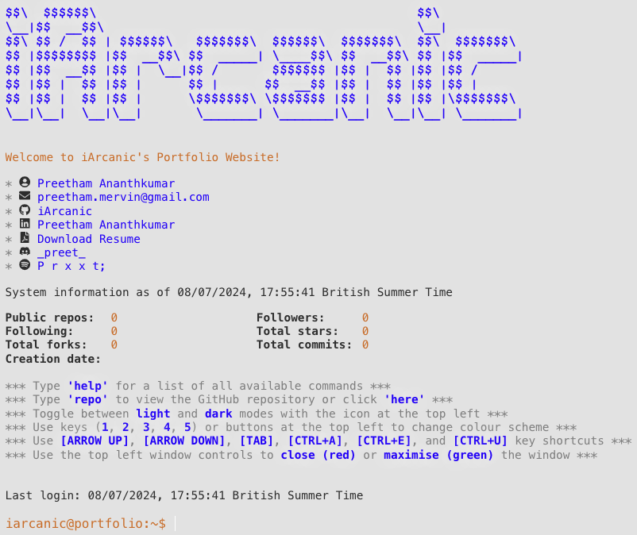   | 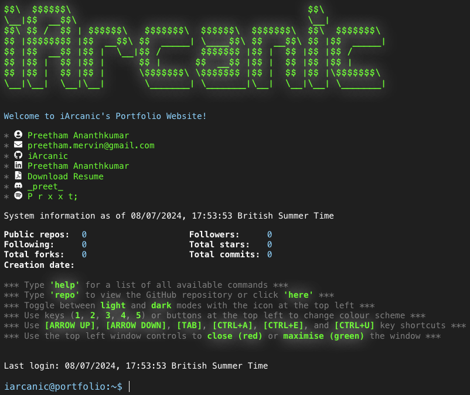   |
| 2: Monokai    | 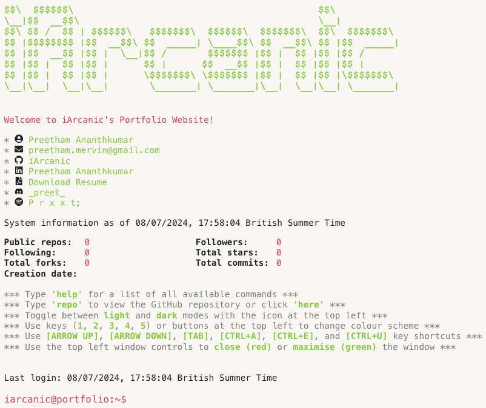   | 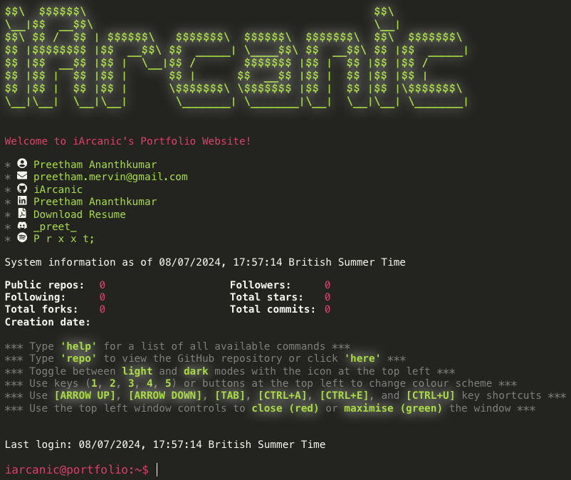   |
| 3: Gruvbox    | 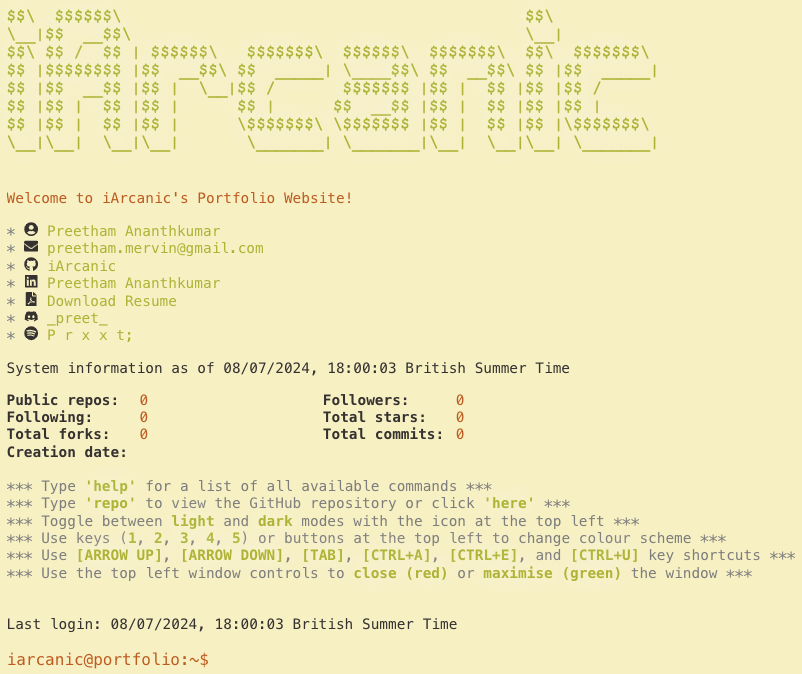   | 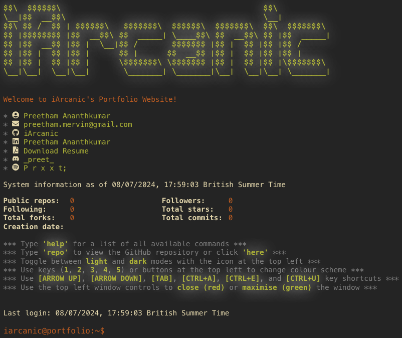   |
| 4: Solarized  | 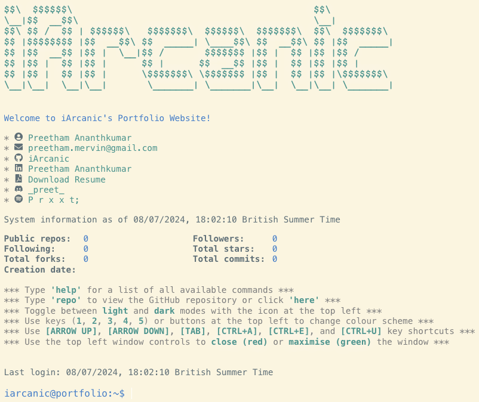 | 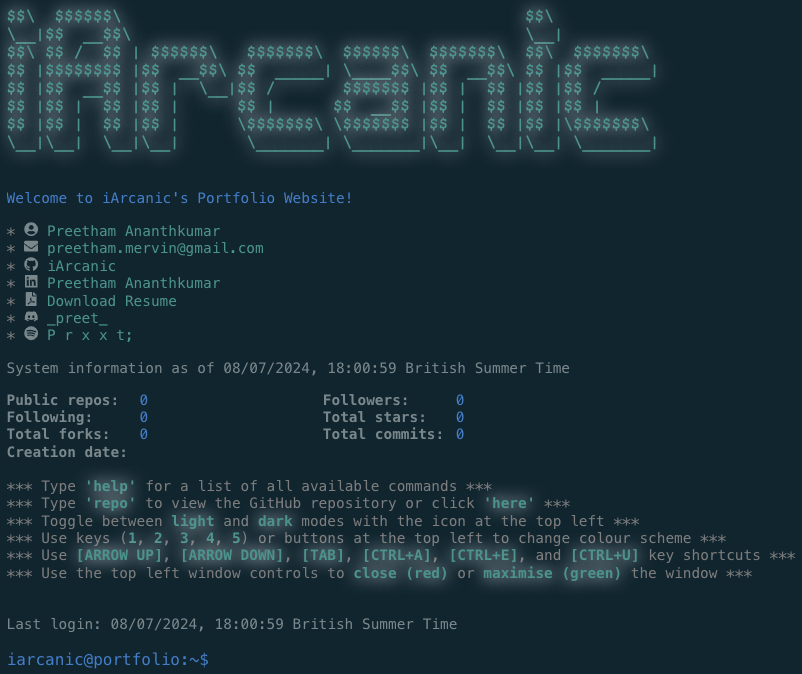 |
| 5: Dracula    |    | 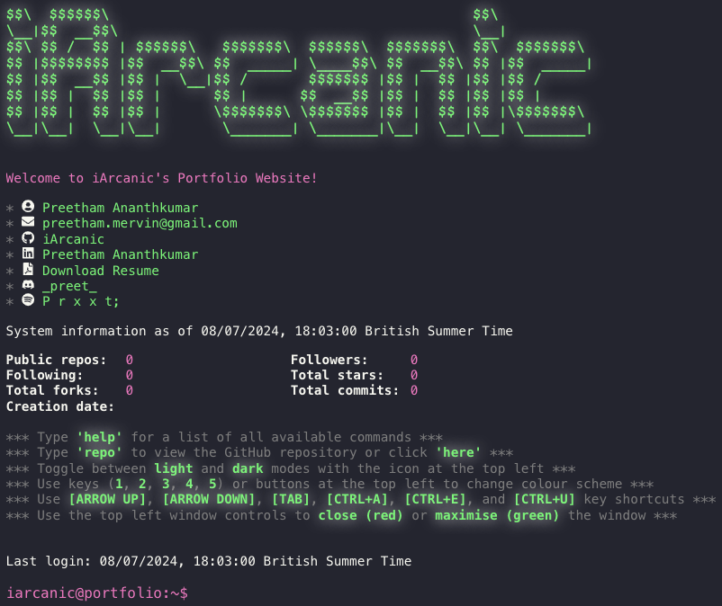   |

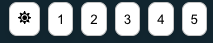

- Use the number buttons or the keyboard number keys to change the colour scheme
- Use the sun/moon icon button to toggle between light and dark modes

### 3.4 Real-time GitHub stats

### 3.5 MacOS style window controls

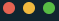

- Red button (x or close)
  - Closes the tab
- Yellow button (- or minimise)
  - Currently does not have a functionality mapped to it
- Green button (expand)
  - Toggle full-screen mode

## 3 Prerequisites

### 3.1 Node.js

Ensure that Node.js is installed on your system with version 20.15.0 (long-term support) or higher.

You can download and install Node.js from the [official Node.js website](https://nodejs.org/en/download/package-manager).

Follow the instructions as per your operating system.

## 4 Usage

1. Clone the repository to your local machine:

```bash
git clone https://github.com/iArcanic/iarcanic.github.io
```

2. Navigate to the project's root directory

```bash
cd iarcanic.github.io
```

3. Install required Node dependencies

```bash
npm install
```

4. Start the development server, accessible via [https://localhost:3000](https://localhost:3000)

```bash
npm start
```

## 5 TO-DOs

- [ ] Make mobile-optimised site
- [ ] Add blog posts
- [ ] Add SSH command loading sequence
- [ ] Add Spotify stats
  - [ ] Top artists
  - [ ] Top tracks
  - [ ] Currently playing
- [ ] Refactor codebase into separate files
